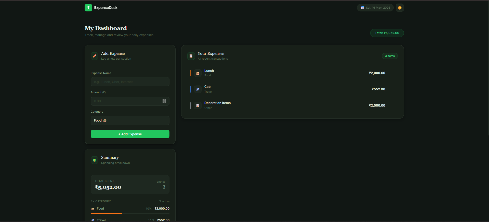
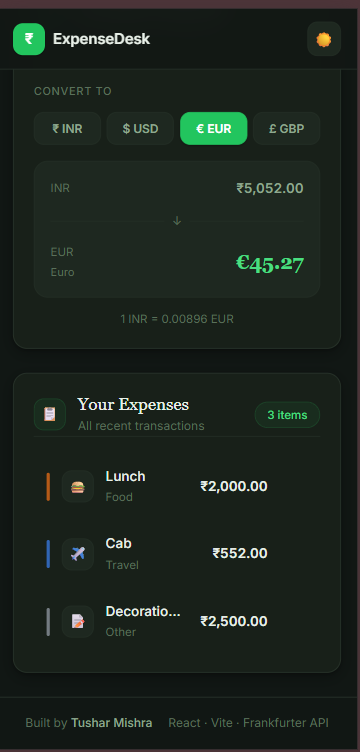
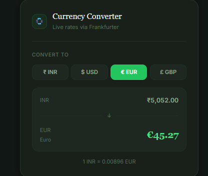

<div align="center">

# ExpenseDesk

### Personal Expense Management Dashboard

Track daily spending, monitor category-wise expenses, and convert totals into multiple currencies — all inside a clean and responsive dashboard experience.

<br/>

<a href="YOUR_LIVE_LINK_HERE">
  
</a>

&nbsp;

<a href="https://github.com/tusharr-mishra/expense-dashboard-react">
  
</a>

<br/><br/>

</div>

---

<div align="center">



<sub>Main dashboard interface showing expense tracking, summaries, and currency conversion</sub>

</div>

---

## About the Project

ExpenseDesk is a responsive personal expense management dashboard built using React and Vite.

The application helps users organize spending records, monitor category-wise expenses, and instantly convert total spending into multiple currencies through live exchange rates.

The project focuses on clean UI design, reusable React components, responsive layouts, and smooth user interaction without unnecessary complexity.

---

## Features

| Feature | Description |
|---|---|
| Add Expenses | Quickly add daily expenses with category selection |
| Delete Expenses | Remove entries instantly from the dashboard |
| Expense Summary | Real-time calculation of total spending |
| Category Breakdown | Visual category-wise expense distribution |
| Currency Converter | Convert total amount into multiple currencies |
| Responsive Layout | Optimized for desktop, tablet, and mobile |
| Clean Dashboard UI | Minimal and modern card-based interface |

---

## Technology Stack

| Layer | Technology |
|---|---|
| Frontend | React |
| Build Tool | Vite |
| Language | JavaScript |
| Styling | CSS |
| Layout | Flexbox + CSS Grid |
| API | Frankfurter Currency API |

---

## Project Preview

### Dashboard Overview


---

### Mobile Responsive View



---

### Currency Converter



---

## Folder Structure

```bash
personal-expense-manager/
│
├── public/
│   └── screenshots/
│
├── src/
│   ├── components/
│   │   ├── CurrencyConverter.jsx
│   │   ├── ExpenseForm.jsx
│   │   ├── ExpenseList.jsx
│   │   └── SummaryPanel.jsx
│   │
│   ├── App.jsx
│   ├── index.css
│   └── main.jsx
│
├── package.json
├── vite.config.js
└── README.md
```

---

## Key Functionalities

- Real-time expense calculations
- Dynamic rendering using React state
- Reusable component architecture
- Currency conversion integration
- Mobile responsive dashboard layout
- Clean typography and spacing system
- Interactive user interface with hover effects

---

## Installation & Setup

Clone the repository:

```bash
git clone [(https://github.com/tusharr-mishra/expense-dashboard-react)]
```

Navigate into the project:

```bash
cd personal-expense-manager
```

Install dependencies:

```bash
npm install
```

Run the development server:

```bash
npm run dev
```

Build for production:

```bash
npm run build
```

---

## Future Improvements

- Expense filtering and search
- Monthly analytics charts
- Local storage persistence
- User authentication
- Dark/light theme customization
- Downloadable expense reports

---

<div align="center">

### ExpenseDesk · Personal Finance Simplified

Built with React, JavaScript, and clean frontend engineering practices.

<br/>

Developed by **Tushar Mishra**

</div>
